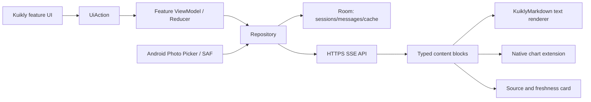

# TalkToAI 第二轮优化文档：Kuikly 组件生态与 ChatGPT Android 对标

日期：2026-09-08  
范围：TalkToAI Android V1；经典 Kuikly DSL；只读 A 股咨询  
当前代码基线：`0491f0a`  
结论性质：公开资料与当前源码审计，不等同于完成依赖接入、许可证法律意见或用户研究

## 0. 2026-09-08 实施回填

| 建议 | 当前状态 | 当前证据或边界 |
|---|---|---|
| KuiklyMarkdown 隔离接入 | 已完成 V1 接入 | 使用 `1.0.6-2.1.21`；完成态消息启用 GFM 渲染并配置深浅主题，流式阶段保留轻量渲染；MIT 文本已归档 |
| Room 与历史分页 | 已完成 | Session/Message 分表；旧 JSON 一次迁移；打开仅取最近 100 条，可逐页加载；5000 条设备测试覆盖顺序、最近页、搜索、软删除级联 |
| 长列表窗口化与本地搜索 | 已完成 V1 范围 | 默认 100 条窗口，100 条递增；会话标题与正文使用 Room SQL 搜索。尚未达到 Macrobenchmark 1000 条滚动门禁 |
| 删除未使用依赖 | 已完成 | 删除 Picasso、RecyclerView、DynamicAnimation 与未使用的 Glide 编译器；Android-only 同时移除 iOS/JS 构建目标 |
| 行情图表复用 | 已完成 V1 范围 | K 线与成交量改用 MPAndroidChart 原生扩展；通用图实例复用；高级十字光标/全屏留 V2 |
| 图片/CSV/TXT 进入模型上下文 | 已完成测试环境闭环 | 服务端重新下载与校验；文本最多 64 KiB，图片使用模型多模态内容块；远端 TXT 已返回附件引用 |
| 启动异常修复与验证 | 未达最终门槛 | 最终 debug AVD 连续 5 次 P50 3.464s、最大/小样本 P90 5.410s；4/5 低于 5s，但整体不满足 P90<5s，仍需 release 真机 30 次 Macrobenchmark |
| 真实行情与持久配额 | 外部阻塞 | 行情仍为明确标识的 fixture；持久配额因 CloudBase 运行时数据库身份不足失败，测试环境已恢复内存回退 |
| typed blocks、Sources 抽屉、朗读/回答分支 | V2 | 不属于已确认 V1 最小闭环；当前保留消息级来源、附件来源和受约束 Markdown/图表边界 |

## 1. 结论

截至评估日，腾讯维护的 [KuiklyUI-third-party 兼容目录](https://github.com/Tencent-TDS/KuiklyUI-third-party) 收录 54 条记录。目录本身采用社区 PR 登记机制，只声明“兼容库目录”，不代表腾讯对质量、安全、许可证或当前版本兼容性背书。54 条中包含平台基础库、重复条目、示例工程和与 Android V1 无关的硬件能力，不能按“54 个 UI 轮子”理解。

对 TalkToAI 最有价值的结论如下：

| 结论 | 推荐 |
|---|---|
| AI 富文本 | 首选对 `KuiklyMarkdown` 做隔离接入实验。它支持经典 DSL、GFM 表格、代码块和流式块级增量渲染，MIT 许可证，且存在 [Kotlin 2.1.21 Maven 产物](https://mirrors.tencent.com/nexus/repository/maven-tencent/com/tencent/kuiklybase/KuiklyMarkdown/1.0.6-2.1.21/KuiklyMarkdown-1.0.6-2.1.21.pom)。用户看到的是原生排版，不是 Markdown 标记。 |
| 对话列表 | `KuiklyChatUI` 适合作为设计和性能参考，不应立即替换。其 [Maven POM](https://mirrors.tencent.com/nexus/repository/maven-tencent/com/tencent/kuiklybase/KuiklyChat/1.0.3-2.0.21/KuiklyChat-1.0.3-2.0.21.pom) 固定到 Kuikly 2.15.0/Kotlin 2.0.21，当前工程为 Kuikly 2.27.0/Kotlin 2.1.21。 |
| 长会话存储 | V1 仅 Android，优先在 Android Bridge 后使用官方 Room，而不是采用许可证不明确、版本较新的社区 Kuikly SQLite 封装。Room 提供 SQL 编译期检查和迁移机制。 |
| 长列表 | 当前普通 `Scroller + vfor` 会创建全部消息节点。先验证 Kuikly ChatUI 的历史分页实现；若版本不兼容，则以原生 RecyclerView/Paging 作为 Kuikly 扩展 View。 |
| 行情图表 | 保留现有 MPAndroidChart 扩展 View 边界。Kuikly 官方图表目前只能核验到[开发任务 Issue #1477](https://github.com/Tencent-TDS/KuiklyUI/issues/1477)，不能当成已发布组件。 |
| 图片附件 | Android V1 优先系统 Photo Picker；`KuiklyAlbum` 版本为 0.0.1-2.0.21，与当前 Kotlin 版本不一致，先不引入。 |
| 状态管理 | 不同时引入 `kuiklyx-viewmodel`、Redux 和 Kisstate。当前已有 MVVM 单向流，真正问题是两个 1100+ 行类职责过大，而不是缺少另一套状态容器。 |
| 依赖收敛 | Picasso、RecyclerView、DynamicAnimation 在生产源码无引用；Glide 已承担图片加载。应在单独提交中删除未用依赖并比较 APK、方法数和启动时间。 |

## 2. 检索口径与可信度

检索来源：

1. [KuiklyUI 官方仓库](https://github.com/Tencent-TDS/KuiklyUI)及其内置组件、扩展 View/Module 机制。
2. [Kuikly 官方兼容库目录的 54 条原始 JSON](https://github.com/Tencent-TDS/KuiklyUI-third-party/blob/main/KuiklyUI-Libraries.json)。
3. [KuiklyBase-components](https://github.com/Tencent-TDS/KuiklyBase-components)、[KuiklyBase-platform](https://github.com/Tencent-TDS/KuiklyBase-platform)及 Kuikly-contrib 各仓库。
4. GitHub 仓库页、README、LICENSE 和腾讯 Maven POM 的当日快照。

限制：GitHub 之外的私有库、未被搜索引擎索引的个人仓库无法证明穷尽，因此“所有”指上述公开、可复核范围。目录中 `KuiklyChatComponent` 当前跳转到 `KuiklyChatUI`，属于重复；`KuiklySQLite` 链接返回 404；部分仓库只有 README 中的许可声明或完全没有可识别 LICENSE，这些不能直接进入生产依赖清单。

评级：A＝可进入技术验证；B＝先做隔离 POC/版本或许可验证；C＝当前 V1 无需求；D＝链接失效、重复或不建议采用。

## 3. Kuikly 内置轮子

| 类别 | 已有能力 | TalkToAI 现状与用途 | 来源 |
|---|---|---|---|
| 基础布局 | View、Text、Button、Image、Input、Scroller/List | 当前页已使用 View/Text/Button/Input/Scroller；无需再造基础控件 | [官方组件索引](https://github.com/Tencent-TDS/KuiklyUI-AI/blob/main/skills/kuikly-ui-framework/SKILL.md) |
| 选择与表单 | Checkbox、Switch、Slider、DatePicker | DatePicker 已用于行情自定义日期；主题等开关可逐步采用语义化控件 | [官方组件索引](https://github.com/Tencent-TDS/KuiklyUI-AI/blob/main/skills/kuikly-ui-framework/SKILL.md) |
| 图形与媒体 | Canvas、Image、Video、APNG、PAG | 行情 K 线目前用 Canvas；图片由 Android Glide adapter 加载 | [官方组件索引](https://github.com/Tencent-TDS/KuiklyUI-AI/blob/main/skills/kuikly-ui-framework/SKILL.md) |
| 导航与系统模块 | Router、Network、SP、Notify、Calendar 等 | 当前已使用 Notify/Calendar 和自定义 Bridge；不建议为 Android V1 重写 OkHttp SSE | [KuiklyUI-AI](https://github.com/Tencent-TDS/KuiklyUI-AI) |
| 原生扩展 | 自定义 Render View 与 Module | 当前 MPAndroidChart、附件、存储、网络都通过该边界接入，方向正确 | [官方扩展能力说明](https://github.com/Tencent-TDS/KuiklyUI-AI) |
| Compose DSL | Kuikly 自有 Compose 包 | 当前工程是经典 DSL；除非整页迁移，不混用 Compose-only 组件 | [KuiklyUI 仓库说明](https://github.com/Tencent-TDS/KuiklyUI) |

## 4. 官方兼容目录 54 项全表

“许可”只记录本次可确认状态；“待核验”意味着不能直接用于生产，不表示闭源。

| # | 组件 | 类型/主要用途 | Android / 动态 | 许可核验 | TalkToAI 判断 |
|---:|---|---|---|---|---|
| 1 | [androidx.annotation](https://github.com/Tencent-TDS/KuiklyBase-platform/tree/main/androidx.annotation) | KMP/OHOS 基础适配 | 是/是 | Apache-2.0（仓库） | C；Android V1 无需单独引入 |
| 2 | [androidx.collection](https://github.com/Tencent-TDS/KuiklyBase-platform/tree/main/androidx.collection) | KMP 集合适配 | 是/是 | Apache-2.0（仓库） | C |
| 3 | [androidx.lifecycle](https://github.com/Tencent-TDS/KuiklyBase-platform/tree/main/androidx.lifecycle) | 生命周期适配 | 是/否 | Apache-2.0（仓库） | C；不要与当前 VM 生命周期再叠一层 |
| 4 | [kotlinx.atomicfu](https://github.com/Tencent-TDS/KuiklyBase-platform/tree/main/kotlinx.atomicfu) | 原子操作适配 | 是/是 | Apache-2.0（仓库） | C |
| 5 | [kotlinx.coroutines](https://github.com/Tencent-TDS/KuiklyBase-platform/tree/main/kotlinx.coroutines) | 协程 OHOS 适配 | 是/否 | Apache-2.0（仓库） | C；项目已有官方协程依赖 |
| 6 | [org.jetbrains.skiko](https://github.com/Tencent-TDS/KuiklyBase-platform/tree/main/skiko) | Skia/Skiko 适配 | 是/否 | Apache-2.0（仓库） | C；无对应需求 |
| 7 | [kotlinx.serialization](https://github.com/Tencent-TDS/KuiklyBase-platform/tree/main/kotlinx.serialization) | 序列化 OHOS 适配 | 是/是 | Apache-2.0（仓库） | C；Android V1 不需 fork |
| 8 | [kotlinx.datetime](https://github.com/Tencent-TDS/KuiklyBase-platform/tree/main/kotlinx.datetime) | 日期时间 OHOS 适配 | 是/是 | Apache-2.0（仓库） | C；可参考交易日规则但不必引入 |
| 9 | [com.squareup.okio](https://github.com/Tencent-TDS/KuiklyBase-platform/tree/main/okio) | Okio OHOS 适配 | 是/是 | Apache-2.0（仓库） | C；OkHttp 已传递使用官方 Okio |
| 10 | [knoi](https://github.com/Tencent-TDS/KuiklyBase-components/tree/master/knoi) | Kotlin Native/ArkTS 桥 | 否，仅 OHOS/否 | Apache-2.0（仓库） | C |
| 11 | [NetworkKMM](https://github.com/Tencent-TDS/KuiklyBase-components/tree/master/NetworkKMM) | 跨端 HTTP | 是/否 | Apache-2.0（仓库） | C；当前 Android OkHttp SSE 更成熟且已测试 |
| 12 | [KmmResource](https://github.com/Tencent-TDS/KuiklyBase-components/tree/master/KmmResource) | 跨端资源管理 | 是/否 | Apache-2.0（仓库） | C；Android-only 收益低 |
| 13 | [trhyl kotlinx.serialization](https://github.com/trhyl/kotlinx.serialization) | 另一套 OHOS 序列化适配 | 是/是 | 待核验 | D；与 #7 重复能力 |
| 14 | [eayui](https://github.com/trhyl/kuikly_easyui) | Kuikly DSL UI 套件 | 是/否 | 待核验 | B；可参考 Design Token，不整库替换 |
| 15 | [kuiklyMultiModuleDemo](https://github.com/susirsusir/kuiklyMultiModuleDemo) | 多模块架构示例 | 是/否 | 待核验 | B；只作拆分 Pager/VM 的参考 |
| 16 | [mmkvKotlin](https://github.com/walkman707/KuiklyMMKV) | MMKV KMP 封装 | 是/否 | 待核验 | C；键值存储不适合长会话查询 |
| 17 | [KuiklyLottie](https://github.com/walkman707/KuiklyLottie) | Lottie 动画扩展 | 是/否 | 待核验 | C；V1 不增加动画成本 |
| 18 | [blackbbc okio](https://github.com/blackbbc/okio/tree/3.9.1-ohos) | Okio OHOS fork | 是/否 | 待核验 | D；与 #9/现有依赖重复 |
| 19 | [koin](https://github.com/blackbbc/koin/tree/4.0.4-ohos) | 依赖注入 OHOS fork | 是/否 | 待核验 | C；当前规模不需要引入容器 |
| 20 | [voyager](https://github.com/blackbbc/voyager/tree/1.1.0-beta03-ohos) | 导航 | 是/否 | 待核验 | C；与 Kuikly Router/现有单页结构重叠 |
| 21 | [ktor](https://github.com/blackbbc/ktor/tree/3.0.3-ohos) | 跨端网络 | 是/否 | 待核验 | C；不要同时保留 OkHttp 与 Ktor 两栈 |
| 22 | [ktorfit](https://github.com/blackbbc/Ktorfit/tree/ohos-2.2.0) | Ktor 声明式 API | 是/否 | 待核验 | C |
| 23 | [coil](https://github.com/blackbbc/coil/tree/3.0.4-ohos) | 图片加载 OHOS fork | 是/否 | 待核验 | C；当前 Glide 已工作，先移除 Picasso |
| 24 | [sqldelight](https://github.com/blackbbc/sqldelight/tree/2.1.0-ohos) | 跨端 SQLite | 是/否 | 待核验 | C；Android V1 优先 Room |
| 25 | [KuiklySqlite](https://github.com/HD-L/KuiklyUISqlite) | KSP ORM | 是/未声明 | 未找到 LICENSE | B；架构可参考，生产暂不采用 |
| 26 | [AnnouncementView](https://github.com/TinyScripts1/AnnouncementView.kt) | 跑马灯 | 是/否 | 待核验 | C；金融风险提示不应滚动后消失 |
| 27 | [KuiklyWidgetGrid](https://github.com/wwwcg/KuiklyWidgetGrid) | 可拖拽看板网格 | 是/是 | 待核验 | B；以后自定义行情看板可评估 |
| 28 | [JsonMate](https://github.com/Kuikly-contrib/JsonMate) | JSONObject KSP 反序列化 | 是/未声明 | 未识别 LICENSE | B；可减少桥接 DTO 样板，先测 KSP/JS |
| 29 | [kuiklyx-bridge](https://github.com/Kuikly-contrib/kuiklyx-bridge) | 插件统一路由 | 是/未声明 | 未识别 LICENSE | B；当前 Bridge 455 行，先比较协议能力 |
| 30 | [kuiklyx-viewmodel](https://github.com/Kuikly-contrib/kuiklyx-viewmodel) | Pager 绑定 VM 生命周期 | 是/未声明 | 未识别 LICENSE | B；README 坐标当日未找到 2.1.21 POM |
| 31 | [kuiklyx-redux](https://github.com/Kuikly-contrib/kuiklyx-redux) | Redux 状态管理 | 是/未声明 | 未识别 LICENSE | C；与已确认 MVVM 冲突，禁止双状态源 |
| 32 | [KuiklyChatComponent](https://github.com/Kuikly-contrib/KuiklyChatComponent) | 聊天 UI | 是/未声明 | README 称 MIT | D；当前重定向到 #45，是重复记录 |
| 33 | [KuiklyCamera](https://github.com/Kuikly-contrib/KuiklyCamera) | 相机 | 是/未声明 | MIT | C；V1 只需选择图片，不做拍摄 |
| 34 | [KuiklyWebview](https://github.com/Kuikly-contrib/KuiklyWebview) | WebView/JSBridge | 是/未声明 | 未识别 LICENSE | C；不以 WebView 承载主聊天/图表 |
| 35 | [KuiklyMMKV](https://github.com/Kuikly-contrib/KuiklyMMKV) | Kuikly DSL MMKV | 是/未声明 | 未识别 LICENSE | C；适合偏好，不适合会话主库 |
| 36 | [VBSQLite](https://github.com/Kuikly-contrib/VBSQLite) | 跨端 SQLite | 是/未声明 | 未识别 LICENSE | B；Android-only 仍优先 Room |
| 37 | [KuiklySQLite](https://github.com/Kuikly-contrib/KuiklySQLite) | 动态化 SQLite | 目录称是/未声明 | 仓库 404 | D；不可采用 |
| 38 | [kuikly-compose-markdown](https://github.com/Kuikly-contrib/kuikly-compose-markdown) | Compose DSL Markdown | 是/否 | 未识别 LICENSE | C；当前是经典 DSL，不兼容直接替换 |
| 39 | [KisstateKuikly](https://github.com/ailuoku6/kisstate-kuikly) | computed/watch 状态 | 是/未声明 | 待核验 | C；避免再加一套状态模型 |
| 40 | [Napier OHOS fork](https://github.com/LiPengfei0106/Napier/tree/2.7.1-ohos) | KMP 日志 | 是/是 | 待核验 | C；现有脱敏日志已有产品约束 |
| 41 | [compose-color-preview-plugin](https://github.com/LiPengfei0106/compose-color-preview-plugin/tree/kuikly) | IDE 颜色预览 | 不适用/否 | 待核验 | C；非运行时组件 |
| 42 | [KuiklyMarkdown](https://github.com/Kuikly-contrib/KuiklyMarkdown) | 经典 DSL/Compose Markdown | 是/否 | MIT；第三方 Apache-2.0 | A；优先 POC，替换自研正则解析 |
| 43 | [Compose DND](https://github.com/LiPengfei0106/compose-dnd/tree/kuikly) | Compose 拖放 | 是/否 | 待核验 | C；当前 DSL/需求均不匹配 |
| 44 | [KuiklyAudio](https://github.com/Kuikly-contrib/KuiklyAudio) | 音频播放 | 是/否 | 未识别 LICENSE | C；语音不是当前 V1 |
| 45 | [KuiklyChatUI](https://github.com/Kuikly-contrib/KuiklyChatUI) | 经典 DSL 聊天会话 | 是/否 | README 称 MIT；API 未识别 LICENSE | B；功能合适但版本冲突，先隔离验证 |
| 46 | [KuiklyAlbum](https://github.com/Kuikly-contrib/KuiklyPhotoSelector) | 图片选择/预览 | 是/否 | MIT | B；0.0.1/Kotlin 2.0.21，Android V1 先用系统 Picker |
| 47 | [KuiklyToast](https://github.com/Kuikly-contrib/KuiklyToast) | Toast | 是/否 | 未识别 LICENSE | C；现有页面内状态更可访问 |
| 48 | [KuiklyDeviceCalendar](https://github.com/Kuikly-contrib/KuiklyDeviceCalendar) | 系统日历事件 | 是/否 | 未识别 LICENSE | C |
| 49 | [KuiklyContacts](https://github.com/Kuikly-contrib/KuiklyContacts) | 联系人 | 是/否 | 未识别 LICENSE | C |
| 50 | [KuiklyLocation](https://github.com/Kuikly-contrib/KuiklyLocation) | 定位 | 是/否 | 未识别 LICENSE | C；A 股首版无需定位权限 |
| 51 | [KuiklyMap](https://github.com/Kuikly-contrib/KuiklyMap) | 地图 | 是/否 | 未识别 LICENSE | C |
| 52 | [KuiklySensors](https://github.com/Kuikly-contrib/KuiklySensors) | 传感器 | 是/否 | 未识别 LICENSE | C |
| 53 | [KuiklyWebsocket](https://github.com/Kuikly-contrib/KuiklyWebsocket) | WebSocket 管理 | 是/否 | 未识别 LICENSE | C；当前协议是 HTTPS SSE，不因有轮子而换协议 |
| 54 | [KuiklyBluetooth](https://github.com/Kuikly-contrib/KuiklyBluetooth) | BLE | 是/目录未声明 | 未识别 LICENSE | C |

## 5. 最相关组件的实用性决策

| 候选 | 收益 | 当前阻碍 | 接入成本 | 决策与验收 |
|---|---|---|---:|---|
| KuiklyMarkdown 1.0.6-2.1.21 | 完整 Markdown AST、GFM 表格、链接、图片、代码高亮、流式块增量 | 需确认与 Kuikly 2.27.0 的二进制兼容；需要将数值表格转图逻辑作为自定义 renderer 保留 | 中 | A。独立分支编译；用 10KB/100KB 流式文本测正确性、峰值内存和卡顿；许可证归档 |
| KuiklyChatUI 1.0.3-2.0.21 | 气泡、消息状态、附件、action、主题、自动到底部、历史分页与扩展 renderer | POM 固定 Kuikly 2.15.0、Kotlin 2.0.21、旧 Markdown；与当前 2.27.0/2.1.21 冲突 | 高 | B。只拉源码或等待同版本发布；不得用 Gradle force 隐藏 ABI 风险 |
| Room + Paging（非 Kuikly 专属） | 结构化会话、分页、迁移、离线查询、错误/重试 | 需要 Android Bridge DTO，KMP UI 不直接访问数据库 | 中 | A。V1 Android-only 的低风险选择；1000/5000 条消息压力测试 |
| MPAndroidChart | 当前已接入，折/柱/饼成熟 | 3.1.0 较老；行情 K 线仍是手写 Canvas；JitPack 供应链需固定校验 | 中 | 保留边界；为行情补 Candlestick/CombinedChart POC，或评估维护更活跃替代品 |
| 系统 Photo Picker | 无需自建图库，权限面更小 | CSV/TXT 仍需 Storage Access Framework | 低 | A。图片走 Photo Picker；文档走 ACTION_OPEN_DOCUMENT，统一 MIME/大小校验 |
| kuiklyx-viewmodel | 自动绑定 Pager 生命周期 | Maven 2.1.21 坐标未核验成功、许可不明；现有生命周期已显式管理 | 低/中 | B。暂不引入；先拆分现有 VM 并补生命周期测试 |
| SQLite/MMKV 社区封装 | 跨端 | V1 不需要跨端；多项许可不明确，生态成熟度低 | 中 | 暂缓；不为未来 iOS 预付复杂度 |

## 6. 当前 TalkToAI 与 ChatGPT Android 对比

这里的“Codex（ChatGPT）App 端”按 ChatGPT Android 移动端比较；Codex 是不同的工程代理体验。OpenAI 官方说明，独立的 Voice in Work/Codex 不在移动端提供，不能把桌面 Codex 功能写成 Android ChatGPT 已有能力。

| 维度 | TalkToAI 当前事实 | ChatGPT Android 官方能力 | 差距与优化 |
|---|---|---|---|
| 产品定位 | 匿名、A 股只读咨询；显式禁止交易 | 通用 AI 助手 | TalkToAI 应强化领域可信度，而不是复制全部通用能力 |
| 对话体验 | 左右气泡、流式、停止、失败重试、复制、点赞、最新回答重生成 | 回答下方/菜单提供 Copy、Good/Bad、Read aloud、Share、Try again；长按使用 Android 选择菜单 | 增加踩、分享、朗读；失败消息不显示点赞；action 按内容/状态显隐。[官方 Android FAQ](https://help.openai.com/en/articles/8142208) |
| 富文本 | 自研正则拆 Markdown；数值表格转折/柱/饼图 | 原生显示表格和图表，部分图表可交互、展开和下载 | 接入 KuiklyMarkdown AST；定义 `Text/Table/Chart/Source/Risk` typed blocks，停止直接从自然语言猜图表 |
| 文件理解 | 图片/CSV/TXT 可选择、校验和上传；尚未证明内容进入模型语义 | 可分析 CSV、文本及多种文档，生成表格/图表 | P0：后端解析、类型探测、截断/采样、注入模型上下文和引用附件页/行。[官方数据分析](https://help.openai.com/en/articles/8437071) |
| 图表 | 折线/柱状/饼状切换；行情 Canvas K 线/成交量 | 交互图通常支持折线、柱状、饼状、散点；还可生成多种静态图并下载 | 金融场景优先分时、K线、成交量、指标联动；禁止把负值或非整体关系默认画饼图。[官方图表说明](https://help.openai.com/en/articles/9213685) |
| 当前信息与来源 | 有 HTTPS 引用和行情 freshness 字段，但测试环境仍是 fixture | Search 可自动/手动触发，回答可带内联引用和 Sources 面板 | 做来源卡片、抓取/市场时间、新鲜度徽标、来源展开页；真实数据授权前保持“测试数据”。[官方 Search](https://help.openai.com/en/articles/9237897) |
| 会话管理 | 本地新建、改名、归档、软删除 7 天、导出；无登录不跨端 | 侧栏最近会话、搜索；登录后跨设备同步；支持归档/删除 | 增加本地全文搜索、按时间分组、撤销删除 snackbar；V1 不伪造跨端同步。[官方历史说明](https://help.openai.com/en/articles/8980299) |
| 项目/上下文 | 侧栏把设置、行情和会话混合；无 project workspace | Projects 将 chats、files、instructions 放在一个工作区并跨设备继续 | V1 可做本地“自选研究夹”，但不要引入登录/同步；股票代码可成为本地上下文域。[官方 Projects](https://help.openai.com/en/articles/10169521) |
| 输入方式 | 文本、图片/CSV/TXT；无语音 | Android 支持语音对话，部分体验可同时使用文本与图片 | 语音放 V2，不挤占 V1 真实行情和可靠性优先级。[官方 Voice](https://help.openai.com/en/articles/20001274) |
| 弱网与离线 | 能查看历史、保存草稿；发送后展示失败与重载 | 官方资料未承诺完整离线能力 | 这是 TalkToAI 可保留的优势；增加请求队列状态和恢复网络后一键重试 |
| 隐私与诊断 | 本地脱敏日志、反馈包；匿名安装每日上限 | ChatGPT 有数据控制、导出和留存政策 | 增加用户可见的缓存/日志清理、附件保留期说明；可逆加密不得称匿名化。[官方留存说明](https://help.openai.com/en/articles/8983778) |

## 7. 当前源码的具体问题

| 证据 | 风险 | 改进 |
|---|---|---|
| [TalkToAiPager.kt](/Users/jerry/JustDoIt/OHHHHH/TalkToAI/shared/src/commonMain/kotlin/com/example/talktoai/talk/TalkToAiPager.kt:37) 1207 行，[TalkToAiViewModel.kt](/Users/jerry/JustDoIt/OHHHHH/TalkToAI/shared/src/commonMain/kotlin/com/example/talktoai/talk/TalkToAiViewModel.kt:13) 1104 行，[KRBridgeModule.kt](/Users/jerry/JustDoIt/OHHHHH/TalkToAI/androidApp/src/main/java/com/example/talktoai/module/KRBridgeModule.kt:1) 455 行 | UI、格式化、行情、会话、设置互相影响，回归面过大 | 拆成 Chat/Market/Session/Settings feature；每个 feature 单独 state/action/reducer；Bridge handler 按域注册 |
| 对话列表使用普通 [Scroller + vfor(messages)](/Users/jerry/JustDoIt/OHHHHH/TalkToAI/shared/src/commonMain/kotlin/com/example/talktoai/talk/TalkToAiPager.kt:241) | 长会话全部节点常驻；已测 janky frames 27.15%，不能视为完成 | 历史分页 + 窗口化；流式时只更新尾部 block；1000 条消息基准作为门禁 |
| [markdownBlocks()/chartData()](/Users/jerry/JustDoIt/OHHHHH/TalkToAI/shared/src/commonMain/kotlin/com/example/talktoai/talk/TalkToAiViewModel.kt:973) 使用正则解析 Markdown | 嵌套表格、转义、流式半块、代码块边界容易错误 | 用 KuiklyMarkdown AST；后端返回 typed content blocks，Markdown 仅作为文字块的传输格式 |
| [SessionStore](/Users/jerry/JustDoIt/OHHHHH/TalkToAI/androidApp/src/main/java/com/example/talktoai/chat/SessionStore.kt:7) 将全会话 JSON 写入 SharedPreferences，终态使用同步 `commit()` | 数据量增长后主线程阻塞、整包编解码、无分页/查询 | Room：Session、Message、Attachment、Source 分表；事务更新尾消息；删除保留期由查询和清理任务实现 |
| [Android 依赖](/Users/jerry/JustDoIt/OHHHHH/TalkToAI/androidApp/build.gradle.kts:43) 同时声明 Picasso 与 Glide，Picasso 无生产引用 | APK/方法数和供应链面无收益增加 | 删除 Picasso；检查无引用的 RecyclerView/DynamicAnimation 是否也能删除；用 before/after APK Analyzer 验证 |
| [TalkDataChartView](/Users/jerry/JustDoIt/OHHHHH/TalkToAI/androidApp/src/main/java/com/example/talktoai/chart/TalkDataChartView.kt:67) 每次配置变化创建新的 MPAndroidChart View | 复杂回答多图时增加分配和布局成本 | 复用 chart 实例和 DataSet；不可见消息释放/暂停；缓存解析后的 typed chart model |
| [验收证据](/Users/jerry/JustDoIt/OHHHHH/TalkToAI/docs/v1/evaluation-2026-09-07.md:22) 表明行情仍为 fixture | UI 再精美也不能完成股票咨询验收 | 取得授权 HTTPS 源；Provider 契约测试覆盖交易日、停牌、复权、延迟、时区和来源 |

## 8. 推荐目标架构

关键原则：模型文本不是 UI 协议。后端应输出有版本的内容块，例如 `paragraph`、`table`、`chart`、`marketSnapshot`、`citation`、`warning`；客户端按类型渲染。即使模型输出 Markdown，也应先在边界解析和校验，不能在 Pager 中用正则猜测结构。

## 9. 分阶段实施顺序

### P0：完成 V1 可信闭环

1. 真实授权行情 Provider 与 freshness 规则验收。
2. CloudBase 持久化每日 500 次限额，并测并发/幂等/跨实例。
3. 图片、CSV、TXT 真正解析并进入模型上下文，回答引用附件来源。
4. 修复最终安装后出现的 11.292 秒异常冷启动，使用 release/profileable Macrobenchmark 重测。

### P1：替换高风险自研基础设施

1. KuiklyMarkdown 隔离 POC：解析正确性、流式增量、选择复制、主题和性能。
2. Room 会话库和分页；旧 SharedPreferences 数据一次性迁移并可回滚。
3. 长列表窗口化；消息 action 按状态显隐；本地会话搜索。
4. 删除未使用依赖，生成 OSS Notice，锁定依赖校验和。

### P2：接近成熟 AI App 体验

1. typed content blocks 与 Sources 抽屉。
2. 表格展开/横向滚动/CSV 导出；图表全屏、十字光标、缩放和数据点详情。
3. Read aloud、分享、踩反馈、回答分支；语音延后到真实行情稳定之后。
4. 本地“自选研究夹”，而不是在无登录 V1 中实现伪跨端 Projects。

## 10. 可审计验收指标

| 领域 | 指标 | 门槛 | 来源/说明 |
|---|---|---|---|
| 启动 | release/profileable 真机冷启动 30 次 | P90 < 5s；内部目标 P50 ≤ 2.5s | 5s 是 Android vitals 冷启动慢阈值；内部目标不是行业统计 |
| 滚动 | 1000 条消息、10 个图表的自动滚动脚本 | janky frames < 10%；P95 frame < 32ms | 项目内部门槛；保留 Perfetto/gfxinfo 原始文件 |
| 流式 | 10KB/100KB Markdown，10/30 token/s | 不丢字、不重复；停止后 500ms 内转终态 | 固定夹具，覆盖半个表格/代码块边界 |
| 存储 | 5000 条消息加载、插入、删除恢复 | 首屏不全量解码；单条追加不重写全会话 | Room benchmark + 数据库查询日志 |
| 附件 | 图片、CSV、TXT 与非法/超限样本 | 回答能引用附件；失败可恢复；正文不进日志 | 接口与 E2E 测试 |
| 行情 | 交易中、收盘、周末、停牌、自定义日期 | 来源/市场时间/抓取时间/freshness 全部正确 | Provider 契约测试，不依赖实时随机值 |
| 无障碍 | TalkBack、字体 200%、触控目标、选择菜单 | 关键链路可完成，无裁切/无不可达操作 | Android Accessibility Scanner + 人工复核 |

Android 官方建议对非平凡结构化数据使用 [Room](https://developer.android.com/training/data-storage/room)，Paging 用于降低大数据集的内存与网络开销并内置刷新/重试能力：[Paging 3](https://developer.android.com/topic/libraries/architecture/paging/v3-overview)。慢渲染排查与 DiffUtil/列表建议见 [Android slow rendering](https://developer.android.com/topic/performance/vitals/render)。

## 11. 不采用的捷径

- 不一次性把页面迁移到 Kuikly Compose，只为使用一个 Compose-only 组件。
- 不用 Gradle `force` 强行让 KuiklyChatUI 跨 Kotlin/Kuikly 版本运行。
- 不因为目录写着“compatible”就跳过许可证、SBOM、CVE、维护活跃度和最小版本测试。
- 不用 WebView 展示聊天主内容，也不从模型 Markdown 中直接执行链接、HTML 或脚本。
- 不因 WebSocket 有现成轮子就更换已经具备取消与断流测试的 HTTPS SSE 协议。
- 不把 ChatGPT 的通用功能清单当作 V1 必做项；真实行情、来源可信和失败恢复优先级更高。

## 12. 最终建议

下一轮最有价值的三个工程提交应是：

1. `spike: validate KuiklyMarkdown on 2.27.0`：只做兼容和性能验证，不直接覆盖现有渲染器。
2. `refactor: persist paged chat history with Room`：解决 SharedPreferences 全量 JSON 和长列表根因。
3. `chore: remove unused Android dependencies`：删除 Picasso 等无引用依赖，并用 APK/启动/方法数证据验收。

其中第 1、2 项必须先各自设计回滚边界；真实行情和云端配额仍是 V1 产品完成的外部关口。组件复用可以降低 UI 与基础设施成本，但不能替代数据授权、契约正确性和真机性能证据。
