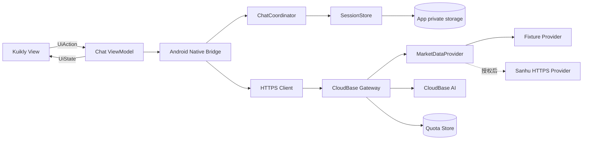

# TalkToAI Android V1 架构

## 组件与数据流

Kuikly View 不直接访问网络或持久层。ViewModel 只发出动作和维护可观察 UI 状态；Android Bridge 将动作交给 `ChatCoordinator`、`SessionStore` 与 HTTPS 客户端。历史 Host 模块已经移除，V1 仅保留 Android 原生能力桥与 CloudBase HTTPS 边界。

## Android UI 状态模型

- 主内容由“对话 / 行情”两个互斥 Tab 承载；侧边栏只负责导航和偏好入口，不承载行情或对话正文。
- 会话消息解析为结构化 `ChatMessageUi`，存放在 Kuikly `ObservableList` 中，并通过 `vfor` 响应新增、流式更新和恢复；兼容性文本 `transcript` 不再作为气泡列表的数据源。
- 用户与 AI 消息分别右、左对齐。复制、点赞和重新生成以消息 ID 定位；V1 只允许重新生成最新一条 AI 回答，避免从历史中间节点隐式分叉。
- 气泡与头像样式是本地 UI 偏好，不改变持久化消息内容和服务端协议。
- Android Activity 使用 `adjustResize`，并避免会阻断 IME 窗口缩放的全屏布局标志，保证输入框随软键盘上移。
- V1 行情图仍为 K 线与同步成交量；饼图、条形图、折线图组成的可配置看板属于后续迭代。

## 后端职责

- 验证请求大小、附件元数据和匿名安装标识。
- 使用 Asia/Shanghai 日期桶执行每日 500 次限额；测试环境当前为进程内存桶，持久化原子计数仍是上线前门槛。
- 通过 CloudBase 云函数内的 Node SDK 调用 `cloudbase / hy3` 并代理 SSE；客户端断开时取消上游生成。凭证不进入 Android 或 Git。
- 调用行情 Provider，归一化代码、时区、价格、成交量、来源和新鲜度。
- 返回稳定 `error.code`、`requestId`；日志不记录正文、附件内容或凭证。

## 本地数据

- 会话、消息、草稿、归档和删除时间保存在 Android 私有目录。
- 删除先进入回收状态，保留 7 天后清理。
- 日志保留 10 天并按每日 5000 条截断；反馈包只含应用版本、设备摘要、网络摘要、经过脱敏的结构化日志及用户主动勾选的信息。
- 需要关联的安装标识使用 Android Keystore 管理的 AES-256-GCM 本地密钥进行可逆加密。反馈包保留密文，不导出密钥，因此只有原安装可双向解码；跨设备解码需要后续引入支持方公钥封装协议。

## 行情新鲜度机器规则

使用中国标准时间（Asia/Shanghai）和交易日历：

| 数据 | FRESH | DELAYED | STALE |
|---|---|---|---|
| 分时/报价，连续竞价中 | 数据时间距当前不超过 60 秒 | 60 秒至 5 分钟 | 超过 5 分钟 |
| 分时/报价，集合竞价或午间休市 | 不超过最近一个有效撮合点 60 秒 | 60 秒至 5 分钟 | 超过 5 分钟 |
| 收盘后报价 | 当日收盘数据且抓取时间不超过 24 小时 | 最近一个交易日数据 | 早于最近一个交易日 |
| 日线 | 最近交易日收盘数据，且交易日 18:30 后已更新 | 最近交易日但仍处更新窗口 | 缺少最近交易日 |
| 周/月线 | 包含当前已完成周/月或由日线现场聚合 | 数据周期尚未完成并明确标为进行中 | 缺少最近已完成周期 |

若交易日历不可用、数据时间无法解析、源端标记延迟，状态至少为 `UNKNOWN` 或 `STALE`，绝不推断为实时。UI 同时展示绝对数据时间和状态文字；AI 上下文包含相同元数据。
