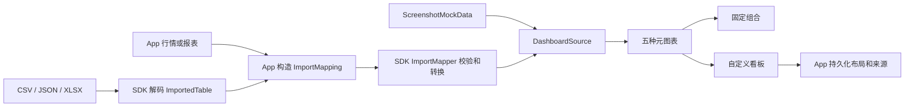

# 图表 SDK 0.3.0 产品方案与 App 接入

## 目标与边界

本次把八张参考图中的可读文本、精确数值和仅用于复现轮廓的序列拆成强类型数据。App 负责真实行情、导入文件、报表和持久化，`market-ui` SDK 负责校验、图表渲染、组合模板与自定义看板交互。所有绘制与触摸区域裁剪在 Card 内。

参考图中没有给出原始点位的数据使用确定性 Mock，并标记为 `VISUAL_APPROXIMATION`；截图中可直接读取的数据标记为 `REFERENCE_TEXT`。它们只用于 UI 验证，不作为真实行情。

## 分层组件

| 层级 | 公共能力 | 编辑布局 |
|---|---|---|
| 数据层 | `DisplayValue`、`ReusableTextData`、`ChartPoint`、`ChartSeries`、纵轴与语义颜色 | 无 |
| 元图表 | 柱状、折线、饼状、横线比例、排名 | 无 |
| 固定组合 | 上文本下图；上文本、下左文本下右图；上左文本上右图、下排名 | 无 |
| 分时组合 | 报价、分时与均价、成交量、五档盘口 | 无 |
| 自定义看板 | 添加、删除、移动、四边缩放、撤销、保存、分页、空位压缩 | 有 |

柱状图支持标准、分组和堆叠；折线图通过枚举支持单线、多线、双轴、面积和分时。Card 可按枚举开启双指缩放和平移、双击全屏、全屏按钮、复原按钮、图表/数据切换和十字线。自定义看板长按 Card 标题区进入编辑，图表内部长按用于十字线，两个手势区域不冲突。

## 数据与渲染流程

App 在文件读取后显示字段映射界面。用户必须确认标签列和数值列，可选择 ID、毫秒时间戳、序列和纵轴列，并填写单位。SDK 拒绝缺失列、非有限数值、非法时间戳、重复 ID 和超过两个纵轴的数据，不静默丢行。当前 App 接受 CSV、平面对象数组 JSON 和 XLSX 首个工作表，单文件不超过 2 MiB、最多 5,000 行。

## 布局与容量

自定义布局在添加、删除、移动和缩放完成后执行纵向压缩，保持稳定顺序并消除可填补空位。Card 不得小于完整显示标题、控制项、图例、坐标与数据所需的最小宽高。单列每页最多 5 张，多列每页最多 10 张；只创建当前页和相邻页的 View。限制按页计算，图表内部数据点通过缩放和平移查看，不按 Card 页截断。

## 八张截图 Mock

`ScreenshotMockData.cards` 保存八张图的结构化样例。App 的 `TalkDashboardView.demoSources()` 将样例转换为 `DashboardSource` 并传入 SDK。初始看板展示资金流入柱状图、资金与股价双轴折线图和行业排名图；其余样例可在“添加卡片”中选择。截图 2 默认选中第一根柱，并显示“通信ETF华夏”、三个标签和 `-0.76%`。

## 当前限制

- 金融详情只实现分时，不包含日 K、周 K、月 K 和其他 K 线周期。
- JSON 只接受平面对象数组；嵌套结构由 App 在传入前展开。
- XLSX 只读取第一个工作表，不执行公式计算。
- SDK 提供渲染和本地转换能力，不获取行情，也不决定数据源标识是否展示。

## 验证入口

SDK：`./gradlew verifyReleaseVersion testDebugUnitTest assembleRelease lintRelease`。

独立消费者：`./gradlew -p examples/consumer assembleDebug`。

App：`./gradlew :shared:compileDebugKotlinAndroid :androidApp:testDebugUnitTest :androidApp:assembleDebug`，设备测试使用 `./gradlew :androidApp:connectedDebugAndroidTest`。
