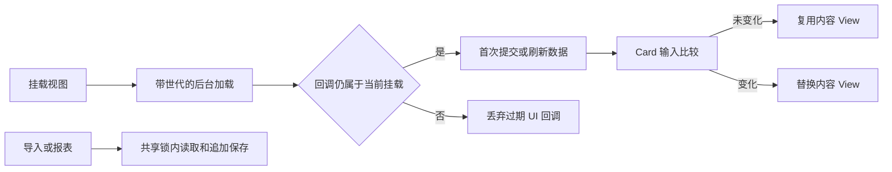

# 可编辑看板优化方案与验收

日期：2026-09-09。基线：App `8e97c5c`，SDK `e348e84`（v0.2.0）。范围为现有 Android 看板链路；先形成方案，再实施。保留原有未提交修改。

## 现状与问题

| 已读代码 | 当前行为 | 本轮优化与验收 |
| --- | --- | --- |
| `market-ui/src/androidMain/kotlin/com/talktoai/marketui/dashboard/DashboardView.kt` / `CardView.bind` | 每次 render 调用 contentFactory，包括编辑／取消和不相关数据刷新 | 每张 Card 按完整模型、来源、全局时间、主题前景和工厂缓存内容；未变更输入复用 View，变更输入正确失效；设备测试验证创建次数 |
| `market-ui/src/androidMain/kotlin/com/talktoai/marketui/dashboard/DashboardCardContainer.kt` / `bindContent` | 每次清空子 View 并重建标题与来源 | 固定标题／来源 View，只在内容实例改变时替换渲染器；避免无意义 detach/attach |
| `market-ui/src/commonMain/kotlin/com/talktoai/marketui/dashboard/DashboardModels.kt` / `DashboardSession` | 撤销快照无限累积 | 最多 50 步，保留进入编辑时完整快照用于取消；边界单测 |
| `androidApp/src/main/java/com/example/talktoai/dashboard/TalkDashboardView.kt` | 构造时加载，detach 丢弃回调，reattach 不重新加载；旧回调可能在重挂后更新 UI | 挂载时加载、世代隔离回调；已加载的编辑草稿重挂后保留；未就绪禁用触摸；设备测试验证恢复与草稿 |
| `androidApp/src/main/java/com/example/talktoai/dashboard/DashboardStore.kt` | 导入与报表在多个 Store 实例上分别读后写；CSV 引号任意翻转 | 进程内共享锁原子追加；严格 CSV 状态机校验引号位置、转义和 CRLF；真实存储并发测试与输入边界单测 |
| `scripts/verify-android-apk.sh` | 上轮已补启动／SDK 类定义检查 | 保留并执行；完整包通过、缺包反例被拦截，防止再次交付不完整 APK |

## 方案取舍

| 方案 | 优点 | 代价／风险 | 结论 |
| --- | --- | --- | --- |
| 局部渲染复用、生命周期隔离、有界状态 | 保持现有注入 API、持久化格式与交互；可逐项回归 | 内容工厂依赖必须完整进入缓存键；异步结果必须检查世代 | 本轮采用，开发成本中、无新增运维依赖 |
| 重写为全新 UI 框架并迁移数据库 | 可重新组织长期架构 | 迁移现有数据、扩大宿主和 SDK 兼容风险，开发／验证成本高 | 当前证据不支持进行整体重写 |

加载结果只更新所属挂载周期。持久化已开始的写入允许完成，UI 回调不穿透已卸载视图；重挂时重新读取数据，保留已建立的编辑会话。来源追加在单进程内串行；不宣称跨进程事务支持。

## 完成门槛

1. 上述五项代码优化全部实现并补对应测试，不把方案文档本身作为完成。
2. SDK 单测、release 构建、Lint、独立消费者通过。
3. 精确提交快照的宿主单测、构建、Lint、APK 完整性检查与模拟器设备测试通过。
4. SDK 发布兼容补丁版本 v0.2.1，App 固定 Git 提交；本地验证后 commit/push，确认两边 CI。
5. 安装完整 APK、验证启动和看板；不清空用户数据。记录实际结果、次数、失败修复及未验证边界。

## 边界

本轮不新增实时行情、多看板管理、XLSX 或跨平台支持。性能目标是消除已确认的重复创建；不以创建次数代替全设备帧率基准。SharedPreferences 全量来源存储仍适合当前小型本地数据，后续规模扩张需独立容量与迁移方案。

## 实施结果

本轮五项优化已实现。SDK 固定提交 `3fde9aa8a8bd310887aa15b12b8af659056cbc0f`，补丁版本 v0.2.1；[SDK 提交 CI](https://github.com/RogerIn1900/kuikly-market-ui/actions/runs/34352132575) 通过。宿主采用单个进程生命周期 IO 线程，确保旧写入与重挂读取有序；不为每次挂载重建线程池。

已执行的验证：

- SDK `verifyReleaseVersion testDebugUnitTest assembleRelease lintRelease`：19 项测试、构建和 Lint 通过；独立消费者 `assembleDebug` 通过。
- 从索引导出宿主、重新从 GitHub 克隆固定 SDK，执行 `:shared:testDebugUnitTest :androidApp:testDebugUnitTest :androidApp:assembleDebug :androidApp:assembleDebugAndroidTest :androidApp:lintDebug`：46 项宿主单测及构建、Lint 通过；合计 65 项单元测试。
- 完整 APK 经 `scripts/verify-android-apk.sh` 检查通过，再覆盖安装到 emulator-5554；`am instrument` 完成 15 项设备测试，无失败。测试 APK 在加强重挂数据刷新断言后重新构建并执行。
- 原工作区也完成 66 项单元测试与 17 项设备测试；其包含原有未提交变更，因此交付以以上精确快照的数量为准。
- 渲染创建次数断言：3 张 Card 初次创建 3 个渲染器；进入编辑、取消、等价数据刷新后仍为 3；更新一个来源后为 4；修改主题前景后为 7。此证据证明目标范围的复用／失效正确，不代表真机帧率基准。
- CSV 验证涵盖非法引号、闭合后多余字符、转义引号、多行、BOM、CRLF、1000 行上限和超过字节限制。存储测试验证 12 个并发追加与来源保留。
- 试图安装到 vivo 真机时设备已断开；优化版暂未完成真机安装验证。模拟器已安装精确快照版本，未清空用户数据。

日志与 APK 哈希见 [验证产物](../../artifacts/dashboard-optimization-2026-09-09/)。本地完整安装包为 `artifacts/talktoai-dashboard-0.2.1-debug.apk`（APK 不纳入 Git）。[宿主 CI](https://github.com/RogerIn1900/TalkToAI/actions/workflows/android-dashboard.yml) 与 [SDK 标签 CI](https://github.com/RogerIn1900/kuikly-market-ui/actions) 由最终远端运行结果确认。

原有未提交改动保留，本轮没有修改后端接口或业务数据格式。
