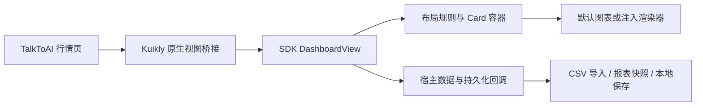

# 可编辑看板 SDK 交付记录

日期：2026-09-09。依据：[设计方案](editable-dashboard-sdk-design.md)。本记录区分已实现行为与验证边界。

## 交付与架构

SDK：[kuikly-market-ui v0.2.0](https://github.com/RogerIn1900/kuikly-market-ui/tree/v0.2.0)，固定提交 `e348e8492544253088b83fa9ce45f131e0d66446`。宿主以 Git 子模块和 Gradle composite build 引用，坐标 `io.github.rogerin1900:market-ui:0.2.0`；不依赖 Maven Central 发布。

SDK 分别提供布局规则、独立 Card 容器、默认图表渲染及可注入内容工厂；宿主负责数据、系统文件选择、保存与报表快照。原 MarketDashboard API 保留。使用说明与可复用 skill 分别位于 SDK 的 `docs/editable-dashboard.md`、`skills/kuikly-dashboard/SKILL.md`，独立消费者示例位于 `examples/consumer`。

## 已实现能力

- 长按 Card 进入编辑；三点按钮点击打开配置，拖动则移动 Card。
- 四边中央三分之一加粗线为缩放手柄；网格吸附、碰撞让位、自动滚动、撤销、取消和显式保存。
- 宽屏最多三列，中屏两列，窄屏单列；依据图表种类自动计算初始高度，手动高度稳定保存。
- 配置数据源、颜色、饼图／条形图／折线图／排行／表格、时间与数值范围、轴范围；提供预览和数据明细。
- 看板命名，添加与删除 Card，关联数据、导入数据及报表快照；保存失败保留编辑草稿。
- CSV 支持 `label,value[,timeMs]`，限制 256 KB、1000 行，校验数值、表头与格式；数据与布局分别持久化，保留来源信息。
- 修复真实 Kuikly 包装 Context 下文件选择无响应、系统 CSV MIME 过滤不兼容以及编辑弹窗主题对比度问题。
- 拖动使用硬件层位移，避免每帧重建图表；目标框显示吸附位置。

## 自动验证

验证顺序：本地检查与设备回归通过后才提交／推送；SDK 远端检查通过后发布标签。App 的提交源通过索引导出独立目录，SDK 再从公开 GitHub 克隆，避免未提交改动参与验证。

| 范围 | 命令／结果 |
| --- | --- |
| SDK | `./market-ui/gradlew -p market-ui verifyReleaseVersion testDebugUnitTest assembleRelease lintRelease`：18 项单元测试及构建、Lint 通过 |
| 独立消费者 | `./market-ui/gradlew -p market-ui/examples/consumer assembleDebug`：通过 |
| App 提交快照 | `./gradlew :shared:testDebugUnitTest :androidApp:testDebugUnitTest :androidApp:assembleDebug :androidApp:assembleDebugAndroidTest :androidApp:lintDebug`：44 项单元测试、APK 与测试 APK 构建、Lint 通过 |
| 设备提交快照 | `adb -s emulator-5554 shell am instrument -w com.example.talktoai.test/androidx.test.runner.AndroidJUnitRunner`：12 项通过，含 4 项新增看板测试 |
| 当前工作区 | 同类检查及 14 项设备测试通过；该数量包含工作区原有改动，不作为提交快照测试数量 |
| Skill | `quick_validate.py market-ui/skills/kuikly-dashboard`：通过 |

SDK [提交 CI](https://github.com/RogerIn1900/kuikly-market-ui/actions/runs/34349649917) 已通过；[SDK 后续标签检查](https://github.com/RogerIn1900/kuikly-market-ui/actions)与 [App 分支检查](https://github.com/RogerIn1900/TalkToAI/actions/workflows/android-dashboard.yml)按实际运行结果验收。远端 CI 构建设备测试 APK，不冒充实际设备执行。

测试覆盖布局碰撞与边界、四向缩放、响应式排布、筛选规则、撤销取消、序列化与版本拒绝、CSV 输入、导入与报表来源、保存失败、包装 Context 文件选择、真实触摸交互及拖动时渲染器复用。

## App 实际操作与性能

在 Android API 36 的 `sdk_gphone64_arm64` 模拟器上验证真实 TalkToAI 行情页：系统文件选择导入三行 CSV，创建表格 Card，设置起始日期筛选为两行，保存报表快照，再保存看板；直接读取持久化结果核对导入三行、报表两行和时间条件。验证数据已清理，原有数据已恢复。

同一模拟器短时拖动采样，`dumpsys gfxinfo` 结果如下。两次采样帧数不同，不构成严格基准或所有设备性能承诺。

| 指标 | 优化前 | 优化后 |
| --- | ---: | ---: |
| 总帧数 | 122 | 204 |
| Janky frames | 70（57.38%） | 11（5.39%） |
| 帧耗时中位数 | 48 ms | 16 ms |
| P95 | 101 ms | 32 ms |
| Missed Vsync | 19 | 0 |

原始日志、截图及脱敏导入结果位于 [验证产物](../../artifacts/editable-dashboard-2026-09-09/)。

## 交付边界

当前为 Android 实现、单个命名看板、单数值序列及可选时间戳。内置市场数据明确标为演示数据，未新增实时行情服务。支持 CSV，不包含 XLSX 导入；没有任意远端查询或多序列报表设计器。横屏／平板布局有规则测试，但未做真机全尺寸性能验收。Skill 随 SDK 交付，未全局安装。

代码发布至 `codex/editable-dashboard` 分支；SDK 标签固定版本。原工作区无关改动未纳入本次提交。
