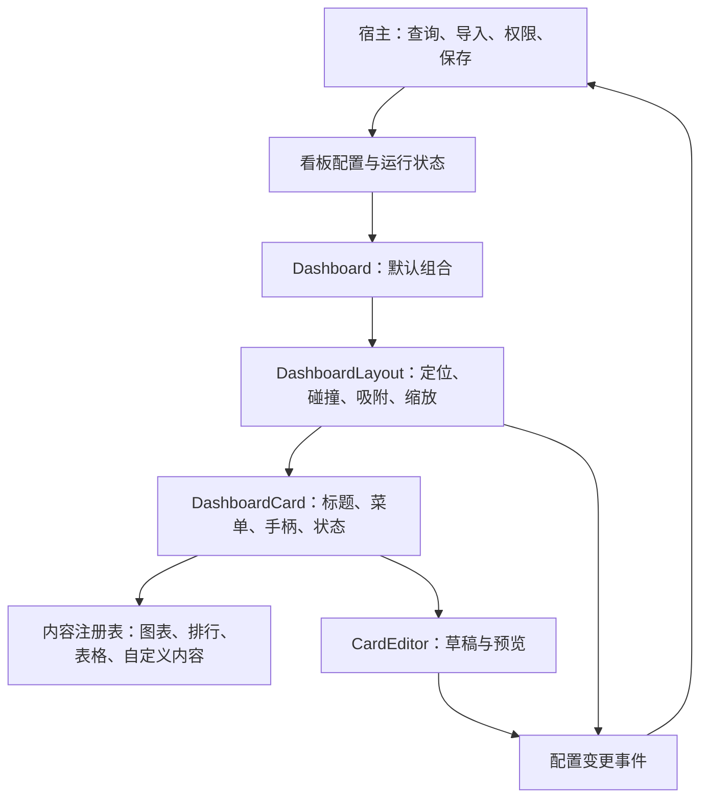
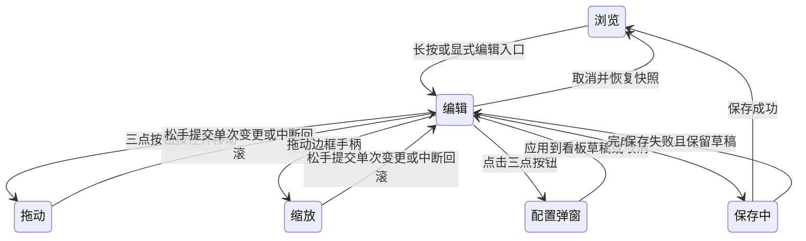

# 可编辑看板 SDK 设计方案

- 日期：2026-09-09
- 目标仓库：`RogerIn1900/kuikly-market-ui`
- 状态：设计快照；实现与验证结果见 [交付记录](editable-dashboard-delivery.md)。本文保留设计时的边界，实际 API 以 SDK 文档为准。
- 全局上下文：`/Users/jerry/JustDoIt/core.md`
- 范围：Kuikly Android 展示组件库；不引入行情后端、账户、交易或数据授权能力。

## 1. 背景与目标

将现有固定行情页面扩展为可组合的看板组件库，同时提供布局引擎、Card 容器、编辑器和默认内容组件，允许接入方分别替换。现有行情页面保留为开箱即用的模板。

用户目标：

1. 长按图表 Card 进入编辑模式，显示三点编辑按钮。
2. 按住三点按钮拖动 Card；点击按钮打开配置弹窗。
3. 配置显示的数据类型、颜色、图表、时间区间和额度区间。
4. 每行最多三个 Card，自动排列并提供合适的初始高度。
5. 编辑模式下，四边中央显示对应边长三分之一的加粗线条；拖动线条调整大小。
6. 支持饼图、条形图、折线图、排行和表格。
7. 自定义看板名称，关联数据、报表或导入的数据。
8. 提供仓库接入 Skill，帮助开发者正确使用组件和扩展契约。

## 2. 已确认现状与证据边界

此前已读取本项目另一个会话「规划高质量 Vibe Coding」，确认目标为独立开源 SDK `market-ui`。

源码核对发现：

- `MarketDashboard` 已注入主题、状态、事件和图表渲染器，但内部固定排列指数、统计、板块和排行榜。
- `MarketDashboardState` 主要表达筛选和排序，尚无通用 Card 位置、尺寸和编辑草稿模型。
- 图表通过宿主 Android 原生视图渲染；新增编辑交互必须处理图表与父容器的手势协调。

源码参考（本轮设计核对使用原工程副本）：

- [固定页面与渲染器注入](/Users/jerry/JustDoIt/OHHHHH/TalkToAI/market-ui/src/commonMain/kotlin/com/talktoai/marketui/MarketDashboard.kt:15)
- [现有状态模型](/Users/jerry/JustDoIt/OHHHHH/TalkToAI/market-ui/src/commonMain/kotlin/com/talktoai/marketui/MarketDashboardModels.kt:32)
- [Android 图表适配器](/Users/jerry/.codex/worktrees/5583/TalkToAI/androidApp/src/main/java/com/example/talktoai/chart/TalkDataChartView.kt:26)

当前 worktree 的 `market-ui` 目录为空。实施前需恢复 SDK 检出，核对固定提交和独立仓库开发分支；不得以原工程的未提交状态替代当前 worktree 的构建证据。

本方案未证明拖动、缩放或手势桥接已在 Kuikly 当前版本运行成功，需先做技术验证。

## 3. 官方参考与借鉴

以下资料在方案研究时已查阅。外部文档可能更新，实施时应固定依赖版本并复核 API。

| 名称 | 官方支持的能力 | 本方案借鉴点 | 官方资料 |
|---|---|---|---|
| React-Grid-Layout | 拖动、缩放、响应式断点、布局序列化；布局算法与 React 组件分离；指定拖动区域与自定义缩放手柄 | 布局独立于内容，结构化保存位置和尺寸 | [官方仓库及 API](https://github.com/react-grid-layout/react-grid-layout) |
| GridStack | 网格拖动缩放、列配置、保存恢复；按内容高度计算网格行数 | 自动高度仍服从网格约束 | [布局 API](https://gridstackjs.com/doc/html/classes/GridStack.html)、[sizeToContent](https://gridstackjs.com/doc/html/interfaces/GridStackOptions.html#sizeToContent) |
| Grafana | 编辑数据源、查询、时间范围、展示样式；区分 Custom 与 Auto grid | 编辑配置与展示分离，明确自动布局和人工调整优先级 | [Panel 编辑器](https://grafana.com/docs/grafana/latest/visualizations/panels-visualizations/panel-editor-overview/)、[看板布局](https://grafana.com/docs/grafana/latest/visualizations/dashboards/build-dashboards/create-dashboard/) |
| Android 无障碍指南 | 建议交互目标至少为 48 × 48 dp | 视觉手柄与实际触摸热区分离，提供非拖动替代操作 | [官方指南](https://developer.android.com/guide/topics/ui/accessibility/apps) |

React-Grid-Layout、GridStack 是 Web 布局方案，不能直接作为 Kuikly 原生组件导入。本方案借鉴其设计，不能据此宣称原生接入已验证。

Grafana 的 Auto grid 不支持手动调整布局；本方案采用下面明确约束的混合策略，并非照搬 Grafana 行为。

## 4. 方案比较与决策

| 方案 | 适用场景 | 优点 | 缺点与风险 | 开发成本 | 维护成本 | 结论 |
|---|---|---|---|---|---|---|---|
| 只提供完整行情看板 | 固定行情产品 | 接入简单 | 业务耦合强，难支持其他报表 | 初期低 | 后期高 | 保留为模板 |
| 只提供拖动网格 | 接入方已有设计体系 | 灵活、边界小 | 每个接入方重复建设 Card 和编辑器 | SDK 中，接入高 | 接入方高 | 作为底层能力 |
| 分层组件与完整默认组合 | 当前开源库 | 易接入且可替换扩展 | 需要稳定契约 | 初期中高 | 中 | 推荐 |

成本与推荐是针对本项目的工程判断，不是外部产品的官方成本数据。参考实现与链接见第 3 节。

先在同一仓库中划分职责，不立即拆成多个发布包。

## 5. 组件架构与职责



| 层 | 负责 | 边界 |
|---|---|---|
| 布局 | Card ID、坐标、尺寸、约束、碰撞和避让 | 不认识股票、报表字段，不查询数据 |
| Card | 标题、来源、加载／空／错误态、菜单、编辑边框 | 不承担布局算法和数据编排 |
| 内容 | 默认图表、排行、表格；允许注册自定义渲染器 | 接收数据与展示配置，声明最小尺寸及推荐高度 |
| 编辑器 | 标准配置、校验、预览、业务扩展插槽 | 编辑草稿，不直接写宿主数据库 |
| 宿主 | 数据获取、文件导入、权限、持久化、刷新和取消 | 通过契约接入，不侵入布局内部 |

现有 `MarketDashboard` 逐步改为上述组件的预设组合，保留旧入口或明确版本迁移方式。

## 6. 编辑交互规范

| 操作 | 行为 |
|---|---|
| 长按 Card | 进入整个看板编辑模式，选中当前 Card；全部 Card 显示三点按钮和四边手柄 |
| 点击三点按钮 | 打开 Card 配置；手机使用底部面板，大屏可使用侧栏 |
| 按住三点按钮移动 | 超过移动阈值后进入拖动，显示占位框和目标位置 |
| 拖动中 | Card 跟随手指，其他 Card 预览避让；接近视口上下边缘时自动滚动 |
| 松手 | 吸附合法位置，形成一次可撤销操作 |
| 拖动四边手柄 | 左右改宽、上下改高；固定对侧边界，限制最小尺寸与画布边界 |
| 完成 | 请求宿主保存整份草稿；成功后退出，失败保留草稿并显示重试入口 |
| 取消 | 恢复进入编辑前的完整配置与布局 |



### 手势互斥

- 识别为拖动后，抬手不得触发菜单点击。
- 首次编辑提示“点按编辑，按住拖动”；提供前移、后移等替代操作。
- 编辑模式关闭图表内部拖动、缩放等手势，由 Card 编辑层接管。
- 浏览模式若图表需要长按取值，进入编辑的长按区域改为标题／外框，并保留显式入口；最终区域通过技术验证确认。
- 手势取消、应用切后台或视图销毁时，取消本次预览并释放手势占用和自动滚动任务。
- 长按时长、移动阈值、自动滚动边缘范围使用命名配置；优先使用平台阈值，具体数值待设备验证。

### 四边缩放手柄

视觉线段位于对应边中央，长度为边长的三分之一。实际触摸热区扩大，但不能与相邻 Card 热区产生不明确归属；命中后锁定当前 Card 与边方向。

Android 48 × 48 dp 建议作为交互目标设计依据；狭窄布局无法容纳时，应降低列数或提供菜单内尺寸操作，不能只画一条难以触摸的细线。

## 7. 网格与高度规则

采用“网格吸附、自动初始高度、手动尺寸优先”。

- 内部六等分逻辑网格，Card 最少占两份，任何横向切片最多三个 Card。
- 宽度支持三分之一、二分之一、三分之二和整行。
- 根据容器宽度及内容最小可读宽度降为两列或一列；最多三个不代表手机必须展示三个。
- 禁止重叠；受碰撞影响的 Card 向下避让，尽量保留其他 Card 位置。
- 保存逻辑网格坐标和尺寸，不保存设备屏幕像素。
- 缩放时以当前 Card 为锚点调整其他 Card；不得通过自动紧凑排列反向抵消用户对上边或左边的调整。

| 高度模式 | 行为 |
|---|---|
| 自动 | 内容组件提供推荐比例、标题／图例高度与最小尺寸，布局层吸附纵向网格 |
| 手动 | 用户调整上下边后切换；数据刷新不改变外框；提供恢复自动高度 |

排行从 5 条增至 50 条时，采用分页、查看更多或受控内部滚动，避免整张看板突然增长。图表不能通过测量“填满父容器”的结果反推父高度，以免尺寸计算循环。

响应式重排不得无声覆盖大屏布局。具体采用分断点布局还是从规范布局派生，需在实现前明确并增加往返恢复测试；推荐先以规范布局派生窄屏展示，窄屏编辑的保存策略通过技术验证确定。

## 8. 配置弹窗与数据契约

| 区域 | 配置项 | 校验 |
|---|---|---|
| 数据 | 数据源、已保存报表、导入数据、指标、维度、聚合、时间区间 | 仅展示数据源支持的字段；不支持时间筛选时说明原因 |
| 展示 | 饼图、条形图、折线图、排行、表格、颜色、标题、单位 | 根据数据结构限制图表类型，切换后重新验证 |
| 范围与布局 | 数值筛选、坐标轴范围、高度模式、尺寸 | 最小值不大于最大值，满足内容约束 |

“额度区间”拆成两个不同配置：

1. 金额／数值筛选：改变结果集，例如只保留成交额 1 亿至 10 亿的数据。
2. 纵轴显示范围：仅改变显示尺度，不过滤数据；饼图不展示此配置。

时间区间默认继承看板设置，允许 Card 覆盖；显式记录时区和相对／绝对区间语义。预览查询需要取消过期请求，避免旧响应覆盖新配置。

建议模型：

| 模型 | 保存内容 |
|---|---|
| 看板配置 | ID、名称、配置版本、默认时间区间、Card 列表 |
| Card 配置 | 稳定 ID、标题、数据引用、字段映射、图表类型、配色、筛选、布局 |
| 数据引用 | 数据集／报表／导入数据类型及引用 ID；报表关联最新版本或固定快照的语义 |
| 运行状态 | 加载、失败、空数据、来源、数据时间；与持久化配置分开 |

数据引用失效时保留 Card 和布局，提示重新关联；不得替换为演示数据。多个 Card 引用同一数据时不在配置内重复保存整份数据。导入解析和文件生命周期由宿主负责。

## 9. 实施阶段

### 阶段一：交互技术验证

使用三张 Card 验证长按、三点按钮拖动、四边缩放、滚动避让和取消恢复，重点验证 Kuikly 容器与 Android 原生图表的事件分配及尺寸更新。

通过后再冻结手势和布局契约；不以静态截图代替交互验证。

### 阶段二：基础组件

实现纯 Kotlin 布局策略、编辑状态机、默认 Card、主题与内容插槽。维持数据、渲染器、保存能力可替换。

### 阶段三：内容与编辑器

支持五类展示、数据关联、预览、看板名称、保存恢复与失败重试，保留行情模板兼容入口。

### 阶段四：开源交付

提供独立消费者示例、接入 Skill、迁移说明和发布检查。Skill 包含数据契约、渲染器注册、布局接线、验证流程及边界，不捆绑宿主凭证和业务配置。

涉及宿主与 SDK 新接口时，先在全局 `core.md` 登记，按项目接口确认流程实施；本设计文档不代表接口已登记或已获发布授权。

## 10. 验收与验证计划

| 层级 | 验证内容 |
|---|---|
| 布局单测 | 不重叠、不越界、每行最多三卡、尺寸约束、连续碰撞、稳定排序、确定性输出 |
| 状态单测 | 取消完整恢复、撤销、手势中断回滚、自动与手动高度转换、保存失败保留草稿 |
| 配置契约测试 | 图表适配校验、非法范围、数据引用失效、配置版本兼容、序列化恢复 |
| 宿主集成测试 | 加载／空／失败状态、过期查询取消、保存失败重试、导入数据引用恢复 |
| 设备交互测试 | 拖动不误触菜单、四边缩放、边缘滚动、图表手势互斥、横竖屏切换、退出重进 |
| 独立构建 | SDK 测试、Release AAR、Lint、独立消费者编译、宿主组合构建 |

拟执行的 SDK 验证命令（本轮未执行）：

```sh
./gradlew verifyReleaseVersion testDebugUnitTest assembleRelease lintRelease
./gradlew -p examples/consumer assembleDebug
```

性能观察重点：拖动／缩放不重复查询数据，不每帧重建完整图表；检查滚动与尺寸变化是否流畅。设备型号、数据规模和实测结果需随实施记录，当前不承诺未经测量的帧率或容量。

## 11. 实施前待决策事项

1. 图表长按取值与 Card 编辑入口的最终命中区域。
2. 窄屏编辑后如何保存布局，避免覆盖宽屏排布意图。
3. 数值筛选的单位与字段来源，由宿主提供能力描述。
4. 采用现有渲染器适配还是额外提供默认 Android 图表适配包；以独立消费者验证为依据。

上述事项可通过技术验证和具体接入需求收敛，不改变分层组件与默认组合的总体方案。

## 12. 本次文档交付边界

本轮仅沉淀设计文档，未新增 SDK 功能、未安装 Skill、未运行生产代码测试、未提交或发布版本。实现阶段必须报告实际命令、测试结果、设备证据与未验证风险。
