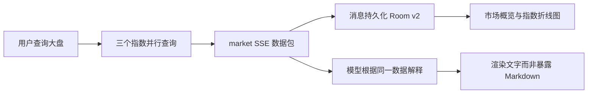

# 对话行情图表与选区工具栏优化 2.3

日期：2026-09-09。范围：TalkToAI Android 和既有 CloudBase 测试函数；未部署生产、未购买数据服务、未操作股票交易或物理设备。

## 实现

- “今天大盘数据”等市场意图先查询上证指数、深证成指、创业板指，将结构化行情通过 SSE `market` 事件返回。单个来源失败保留其他成功项，全部失败给出可重试错误且不消耗模型配额。
- 参考样例的市场概览、市场温度、指数卡片层次，复用既有 MPAndroidChart 原生折线图，显示点位、涨跌、日期坐标、图例、来源、数据时间和新鲜度，保留全屏、归位及详情入口。概览放在 AI 正文之前，不要求模型先生成表格。
- 市场温度仅统计返回的指数样本，不冒充全市场个股涨跌家数，也不凭三个样本给出“偏强/偏弱”评级。
- 将行情 JSON 绑定并持久化到 AI 消息，历史回答保持当时依据。Room 从 v1 非破坏迁移至 v2，新增字段默认空字符串；旧消息无行情包时不补造曲线。
- 修复既有会话父表 `INSERT OR REPLACE` 触发外键级联删除的问题：改为 Room `@Upsert` 原位更新父表，流式只更新尾消息时不再删除之前的用户消息或回答。补充真实 SQLite 外键边界回归测试。
- 文本操作栏使用“气泡在父容器内的位置 + 原生选区底部 + 12dp 手柄间距”，定位在选区下方。先更新位置再显示，避免使用上一选区的位置。用户短气泡的操作栏右对齐，AI 操作栏左对齐，避免按钮横向溢出。



## 实现位置

- `backend/functions/talktoai-api/src/app.ts`：意图、三指数聚合、部分失败、模型上下文。
- `backend/functions/talktoai-api/src/market-data.ts`：Tushare 已识别指数改用 `index_daily`；[官方文档](https://tushare.pro/document/1?doc_id=95)。该接口仍需数据权限，不自动开通或付费。
- `androidApp/src/main/java/com/example/talktoai/chat/ChatCoordinator.kt`、`SessionStore.kt`、`db/ChatDatabase.kt`：消息绑定、编码、恢复和迁移。
- `shared/src/commonMain/kotlin/com/example/talktoai/talk/MarketOverviewUi.kt`：校验和图表转换。
- `shared/src/commonMain/kotlin/com/example/talktoai/talk/TalkToAiPager.kt`、`TalkToAiViewModel.kt`：卡片和选区定位。

## 验证命令

```sh
./gradlew :shared:testDebugUnitTest :androidApp:testDebugUnitTest :androidApp:lintDebug :androidApp:assembleDebug :androidApp:assembleDebugAndroidTest --offline --no-daemon
cd backend/functions/talktoai-api && npm test && npm run build
adb -s emulator-5554 shell am instrument -w com.example.talktoai.test/androidx.test.runner.AndroidJUnitRunner
shasum -a 256 -c artifacts/SHA256SUMS.txt
git diff --check
```

最终结果：共享层 18 项、Android JVM 22 项、设备 9 项、后端 31 项，共 80 项通过，失败 0；Lint 和 APK 构建通过。设备新增会话父表更新不删除历史消息测试。测试覆盖无 Markdown 的结构化图表、非法/空数据过滤、选区偏移、序列化保存、迁移 SQL、部分指数失败、全部失败后的配额保留，以及原有图表交互回归。迁移 SQL 测试不等于所有历史版本的完整升级矩阵。

过程发现并修复：Kuikly JSON API 与 org.json 不同；首轮本机 ADB 未授权（冷启动及重启本机 ADB 服务后恢复）；首次云函数更新后立即访问仍返回旧代码，重新更新并用真实 HTTPS SSE 响应确认三个指数；视觉复验发现短用户气泡操作栏超出屏幕，补充右对齐。

最后安装遇到系统组件更新队列阻塞，旧测试包运行仅有 8 项，未计入最终回归。取消本次两个挂起安装请求、保留数据重启模拟器、顺序安装后重跑，最终确认为 9 项通过；设备内 APK SHA-256 与交付文件一致：`b3881708dca5a4719ac862683f5b7cad152517580a7a32062760efb713e60911`。日志只规整行末空格和尾部空行，不改动结果。

证据在 `artifacts/runtime-2026-09-09/`：构建日志、后端测试日志、设备测试日志、人工测试的 SSE 和模拟器截图。APK 为 `artifacts/TalkToAI-v1-debug.apk`，校验值见 `artifacts/SHA256SUMS.txt`。

- `market-overview.png`：云端测试行情生成市场概览与指数折线图。
- `selection-ai-below.png`：AI 回答局部选区下方显示复制、全选、取消。
- `restored-overview-and-copy.png`：冷启动恢复原行情快照，并成功复制选中的文字（系统剪贴板提示可见）。
- `final-restored-user-and-market.png`：最终 APK 强制停止后，新用户消息和对应行情卡片均恢复。
- `selection-user-below.png`：右侧短用户气泡的三个操作按钮全部位于屏幕内、所选文字下方。

最终存储修复后重新发送 `today market`，收到行情与流式文字后执行 `am force-stop`，读取测试数据库核对消息元数据：旧 AI 消息 position=0；新 user position=1、正文 12 字符；新 assistant position=2、正文 290 字符、行情 JSON 2497 字符。新旧消息均保留，不再仅剩尾消息。仅记录测试消息长度与角色，不把用户数据库作为交付附件。

## 数据与验证边界

测试云端目前只有 fixture 固定行情可用，Tushare Token 和 AKShare HTTPS 服务地址未配置；样本时间为 2026-09-04，明确显示“已过期”和“测试固定数据（非实时行情）”。本次证明的是查询到图表的链路，不是今日真实行情准确性。接入真实数据仍需要外部凭证及展示/缓存授权，不能把测试数值当作当前指数点位。

未验证实体手机、多机型、大字体及长时间内存压力。选区接近视口底边、跨屏全选后的操作栏可见性仍需专项覆盖；本次位置规则始终在选区下方，不声称解决所有跨屏选择场景。旧版无结构化字段的回答需重新查询才能获得对应卡片。

之前因父表 REPLACE 而已丢失的历史消息无法凭现存尾消息还原；本次只保证修复后的写入不再触发该丢失机制，不编造恢复内容。
