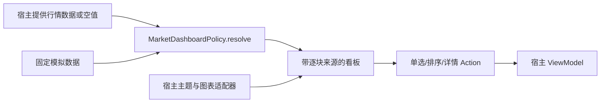

# 可复用行情 UI SDK

本模块是 Kotlin / Kuikly Android Library，当前版本 0.1.0。已在 TalkToAI 行情 Tab 接入；尚未上传 GitHub、发布 Maven 或实现动态插件加载。

## 封装方式比较

以下成本和推荐是结合本项目的工程判断，不是性能实测结论。

| 方式 | 适用与复用性 | 开发 / 运维成本 | 主要限制与风险 | 推荐及官方依据 |
|---|---|---|---|---|
| 独立 UI SDK（源码模块 → Maven/AAR） | 多个 Kuikly Android App 复用同一契约、主题和组件；版本化依赖 | 当前低 / 发布后中 | 需管理 Kuikly/Kotlin 兼容性；单独 AAR 不自动携带传递依赖 | **当前推荐**。Android 官方支持 Library/AAR，并推荐 Maven 分发管理依赖：[Android Library](https://developer.android.com/studio/projects/android-library) |
| GitHub 源码仓库＋Gradle 组合构建 | 需要源码调试、深度定制或协同开发；可托管同一 SDK | 提取独立构建中 / 上游同步中 | GitHub URL 本身不是可消费的二进制依赖；必须固定版本并提供可独立构建的配置 | 作为 SDK 的源码分发渠道，不替代 SDK 架构：[Gradle Composite Builds](https://docs.gradle.org/current/userguide/composite_builds.html)、[Kuikly 官方源码](https://github.com/Tencent-TDS/KuiklyUI) |
| 运行时插件 | 宿主已有稳定插件协议、权限与生命周期时适用 | 高 / 高 | 当前项目没有行情 UI 插件加载协议；会增加版本隔离、资源加载和安全边界 | 暂不实现；未找到本项目可直接使用的官方行情插件协议。Kuikly 能力以[官方仓库](https://github.com/Tencent-TDS/KuiklyUI)为准，不能把普通依赖称作运行时插件 |

SDK 决定代码边界，GitHub 决定源码托管渠道，Maven/AAR 决定构建产物分发渠道，三者可以组合。

## 组件清单

| 板块 | 展现和交互 | 当前数据 |
|---|---|---|
| 指数卡片 | 点位、涨跌幅、迷你折线；点击进入个股查询 | 固定模拟指数 |
| 市场统计 | 涨跌分布饼图、成交额柱图、流入流出饼图、大小盘柱图 | 每块独立标注模拟来源 |
| 热门板块 | 行业/宽指主题单选；涨幅/流入/关注排序；等面积红绿热力块与趋势 | 固定模拟；没有收益承诺或伪造新闻 |
| 股票与 ETF 排行 | 涨/跌/换手率单选，排序柱图＋明细 | 固定模拟，不提供交易 |
| 数据来源条 | 来源、样例/真实、时间、状态 | 随数据块输入 |
| 个股查询（宿主原有） | K 线、成交量、周期与日期查询；空数据出现模拟 K 线 | 原 Provider 结果优先，空数据仅 UI 兜底 |

当前公开复用入口为 `MarketDashboard` 整体看板和 `marketPanel` 容器；内部卡片尚不是单独发布的组件。原生图表由宿主注入，SDK 不绑定网络、账户、数据库、Activity 或 AI。



空值或无效块逐块兜底；有效块保留原来源。模拟样例不进入 Provider、Room 行情缓存或 AI 提示上下文。全零饼图按不可绘制样例兜底，真实的零涨跌幅仍保留。流入/流出饼图必须传非负绝对额，不用带符号净额冒充占比。

## 当前接入

`shared/build.gradle.kts` 使用 `implementation(project(":market-ui"))`。宿主传入：

- `MarketDashboardData`：八个独立带来源的数据块；当前宿主传空值，表示没有可用汇总数据。
- `MarketDashboardState` 与 `MarketDashboardAction`：单选状态和事件。
- `MarketPalette`：颜色；宿主负责主题变化后的刷新。
- `chartRenderer`：把 `DashboardChart` 转为宿主图表。TalkToAI 复用已有 MPAndroidChart 原生桥，新增无坐标/无工具栏的迷你趋势模式；完整图仍保留坐标、图例、全屏和归位。

构建：`./gradlew :market-ui:testDebugUnitTest :market-ui:assembleRelease --offline`。
产物：`market-ui/build/outputs/aar/market-ui-release.aar`；这是 UI 库，不是完整 APK。外部消费仍需匹配 Kuikly 依赖和图表适配器。未来提取 GitHub 仓库需补独立 settings、插件版本和 CI，再验证 Maven 元数据；本文没有提供不存在的远程坐标。

## 边界

仅 A 股与 Android。未复制参考图的商标、图片素材、新闻或“有机会”评级；参考其信息层级和图表布局。模拟标的名称不代表真实报价。当前未新增真实全市场/行业/ETF 数据接口，未部署云函数、创建付费资源或发布 SDK。

## 本轮验证（2026-09-09）

执行：

```sh
./gradlew :market-ui:testDebugUnitTest :market-ui:assembleRelease :shared:testDebugUnitTest :androidApp:testDebugUnitTest :androidApp:lintDebug :androidApp:assembleDebug :androidApp:assembleDebugAndroidTest --offline --no-daemon
adb -s emulator-5554 install --no-streaming -r androidApp/build/outputs/apk/debug/androidApp-debug.apk
adb -s emulator-5554 install --no-streaming -r androidApp/build/outputs/apk/androidTest/debug/androidApp-debug-androidTest.apk
adb -s emulator-5554 shell am instrument -w com.example.talktoai.test/androidx.test.runner.AndroidJUnitRunner
```

- 构建成功；SDK 7、shared 19、Android JVM 22，共 48 项 JVM 测试通过。
- 模拟器 10 项测试通过，包含新增迷你图切回完整图的控件边界验证及既有数据库回归。
- Lint 无阻断错误，有 50 条警告（包括依赖版本、目标 API、CheckResult 等）；不是零告警交付。
- 已人工查看模拟器截图：市场总览、行业板块、资金流入单选后旧按钮恢复默认且半导体排第一、股票/ETF 图表列表。
- 个股空数据模拟 K 线本轮完成构建和样例 OHLC 单测，尚未补独立设备端空数据场景自动化；未验证物理真机、深色大字体组合、外部 App AAR 消费或真实汇总数据。
- 本轮没有重新执行后端测试，未修改后端接口；不能据此宣称真实行情端到端通过。

日志：`artifacts/runtime-2026-09-09/market-sdk-build.log`、`market-sdk-device-tests.log`。
截图：同目录 `market-sdk-dashboard.png`、`market-sdk-sectors.png`、`market-sdk-flow-selected.png`、`market-sdk-rankings.png`。
APK SHA-256：`396d2bc7a2d91ea2bc14a65bf815161fc8419498a8e5630d4e69db76cf53fe0b`。
