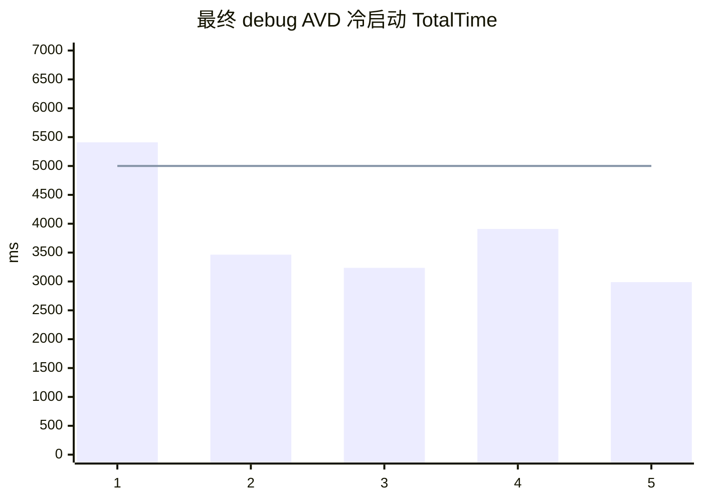

# TalkToAI Android V1 第二轮优化验证报告

日期：2026-09-08  
范围：Android-only、Kuikly UI、CloudBase 测试环境；不包含生产发布、应用商店或交易能力。

## 结论

第二轮文档中可在现有权限内完成的 V1 工程项已落地：Room 分表与分页、本地正文搜索、KuiklyMarkdown、MPAndroidChart K 线/成交量、混合量纲双轴、附件进入模型上下文、缓存上限与未用依赖清理。功能、接口、构建和 AVD 设备测试通过。

项目仍不能标为“可生产”：行情 Provider 仍是明确标识的固定测试数据；每日 500 次仍是单温实例内存计数；debug AVD 冷启动小样本 P90 未达到 5 秒门槛。三项均在本报告末尾列为阻塞或未达标，不用 UI 通过替代生产结论。

## 自动验证

| 层级 | 实际命令/数据源 | 结果 |
|---|---|---|
| 后端接口与规则 | `cd backend/functions/talktoai-api && npm test && npm run build` | 19/19 通过；TypeScript 构建通过 |
| shared 规则 | `./gradlew :shared:testDebugUnitTest` | 11/11 通过；含行情意图、Markdown 表转图、表格正文隐藏、饼图约束、日期和输入状态 |
| Android JVM | `./gradlew :androidApp:testDebugUnitTest` | 20/20 通过；含 SSE、HTTP、附件、缓存、行情负载、坐标量纲策略 |
| Room 设备测试 | `./gradlew :androidApp:connectedDebugAndroidTest` | 2/2 通过；AVD API 36.1；5000 条用例 1.115s，中断恢复用例 0.017s |
| 静态检查 | `./gradlew :androidApp:lintDebug` | 0 error、55 warning；warning 主要为旧依赖版本、国际化与 Kuikly/Android 弃用 API |
| 构建 | `assembleDebug`、`assembleRelease` | debug 与 unsigned release 均成功；release 未签名，不能作为发布包 |
| 远端健康 | 测试网关 `GET /health` | HTTP 200；`aiReady=true`、`marketReady=true`、`marketProvider=fixture`、`attachments=ready` |
| 远端附件闭环 | TXT 上传后发起真实 CloudBase AI SSE | 201 上传；回答包含附件来源并读到样例值 42；越权对象引用接口测试为 403 |

自动化测试总数为 52：后端 19、shared 11、Android JVM 20、Android 设备 2；全部通过。该数字不包含人工 UI 检查。

## 设备功能证据

| 场景 | 结果 | 证据 |
|---|---|---|
| 今日行情对话 | 先出现行情数据和图表，再完成 AI 回答；明确显示过期固定测试数据 | `artifacts/runtime-2026-09-08/final-dark-chart-no-table.png` |
| Markdown 数值表 | 表格源码不再重复展示；保留说明文本，默认折线并可切柱状 | 同上 |
| 混合量纲 | OHLC 使用左轴、成交量自动使用右轴，不再压扁价格曲线 | 同上 |
| 行情 Tab | K 线与成交量上下窗、横纵轴含义、图例、数据时间、来源和缓存状态可见 | `artifacts/runtime-2026-09-08/final-market-kline-volume.png` |
| 主题与页面保持 | 切换深色后仍停留外观设置，按钮立即显示选中态 | `artifacts/runtime-2026-09-08/final-dark-stays-appearance.png` |
| 会话搜索 | 会话页显示“搜索会话名称或内容”；设备正文查询能保留命中会话 | `artifacts/runtime-2026-09-08/final-session-content-search.png` |
| 安装与入口 | `adb install --no-streaming -r -t` 成功，`KuiklyRenderActivity` 为 resumed Activity | 设备命令输出；未发现 FATAL EXCEPTION 或 App ANR |

## 性能与体积

debug AVD 在最终代码的 5 次 force-stop 冷启动 `TotalTime` 为 5410、3464、3236、3910、2988 ms：P50 3464 ms，最小 2988 ms，最大及小样本 P90 5410 ms，4/5 低于 5 秒。最终候选覆盖安装后的首次启动另为 8831ms，单独披露、不并入五次样本。数据来自 `adb shell am start -W`，受 debug 构建、模拟器和宿主负载影响，不能冒充 release 真机 Macrobenchmark。

| 指标 | 优化前基线 | 最终 | 变化与解释 |
|---|---:|---:|---|
| debug APK | 6,946,389 B | 8,079,139 B | +1,132,750 B（+16.31%）；删除 4 项未用依赖曾节省 54,864 B，但 Room 与完整 Markdown 渲染器带来净增长 |
| 默认会话首屏 | SharedPreferences 全会话 JSON | Room 最近 100 条 | 首屏不再读取其他会话正文；更早消息每次增加 100 条 |
| Room 5000 条设备用例 | 无 | 1.115s | 包含批量插入、全量顺序、最近 100 条、正文搜索、计数与软删除级联，不是单一查询基准 |
| 通用图实例 | 配置变化时新建 | 按折/柱/饼各复用一个 | 降低反复切图的 View 分配；尚缺 heap allocation benchmark |

## 制品

- 可安装 debug APK：`artifacts/TalkToAI-v1-debug.apk`，8,079,139 bytes，SHA-256 `638c68a19e37f6cd9bbe0baa4109c2b44be84148f7ef985451cd9fdd29cb475a`。
- `assembleRelease` 生成的是未签名校验产物，不作为可发布 APK 交付；未配置生产签名，也未发布应用商店。

## 尚未通过的门槛与剩余风险

1. 真实授权 A 股 HTTPS Provider 未提供，当前只能使用带 `STALE/固定测试数据` 标识的 fixture；这是股票咨询生产验收的硬阻塞。
2. 关闭 `ALLOW_EPHEMERAL_QUOTA` 后，CloudBase HTTP 函数因数据库服务身份不足返回 500；测试环境已恢复内存计数。需要在控制台为函数配置服务端数据库身份后再做 1/500/501、并发与跨实例测试。
3. 冷启动的小样本 P90 为 5.410s，未达到第二轮文档的 P90 < 5s；还缺 signed release/profileable 真机 30 次 Macrobenchmark、1000 条滚动 jank 与 100KB 流式 Markdown 性能门禁。
4. Kuikly 与部分 Android API 有弃用 warning；不影响当前构建，但升级 Kuikly 前需单独迁移 observable/PagerScope 和系统栏 API。
5. `npm audit --omit=dev --audit-level=high` 仍报告 CloudBase SDK 传递依赖 1 个 moderate、4 个 high；自动修复会把 SDK 降到破坏性版本，未在本轮擅自执行。上线前需由 CloudBase 官方升级链或隔离替换解决。
6. typed content blocks、Sources 抽屉、朗读、踩反馈、回答分支、图表十字光标/全屏属于 V2，未伪装成 V1 已完成能力。
